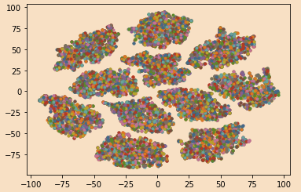

## 基于fastai v2的triplet实现，在mnist上做了测试，降维可视化效果很好


**注意：nn中的triplet margin loss不能用，原因是输出pred为元组，被当做一个变量处理了，具体参考learner._do_one_batch()**<br>

在看这些代码之前，你需要了解triplet的实现原理，fastai的基本用法<br>




## 具体代码分析：
参考[fastai文档中的Siamese实现](https://docs.fast.ai/tutorial.siamese.html)

## transform

知识点
    
    dict.get(key, args):如果key存在，返回value，否则返回args

    为什么transorm中不定义self.train？
        dls中的train和valid是根据splits划分的，具体参考core.py中的subset()函数和TfmdDL、DataLoaders类

    encodes中返回的cls没有用，但是必须返回，因为fastai在获取训练数据时，用了切片，把最后一个元素切下来当做标签，如果不加cls，输入会少张图。具体参考learner._split()


```python
class TripletTransform(Transform):
    def __init__(self, files, splits):
        self.splbl2files = [{l: [f for f in files[splits[i]] if label_func(f) == l] for l in labels}
                          for i in range(2)]
        self.valid = {f: self._draw(f,1) for f in files[splits[1]]}
    def encodes(self, f):
        f2,f3,cls = self.valid.get(f, self._draw(f,0))
        img1,img2,img3 = PILImage.create(f),PILImage.create(f2),PILImage.create(f3)
        return TripletImage(img1, img2, img3, int(cls))
    
    def _draw(self, f, split=0):
        cls1 = label_func(f)
        cls2 = random.choice(L(l for l in labels if l != cls1))
        while len(self.splbl2files[split][cls2]) == 0: 
            cls2 = random.choice(L(l for l in labels if l != cls1))
        return random.choice(self.splbl2files[split][cls1]),random.choice(self.splbl2files[split][cls2]),cls1
```

